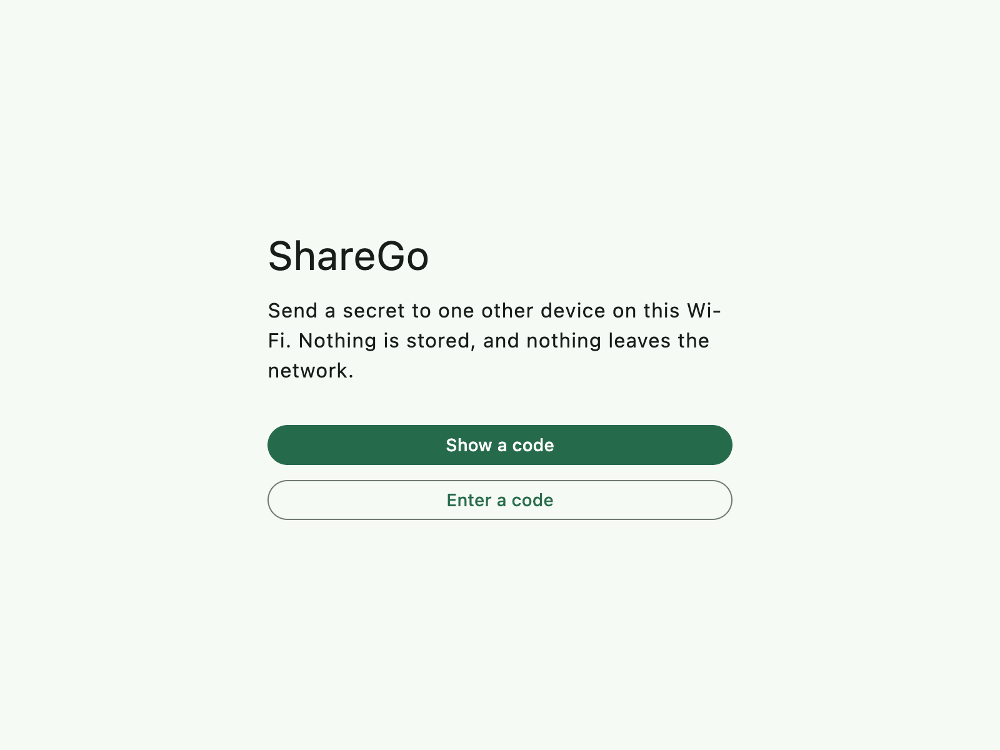
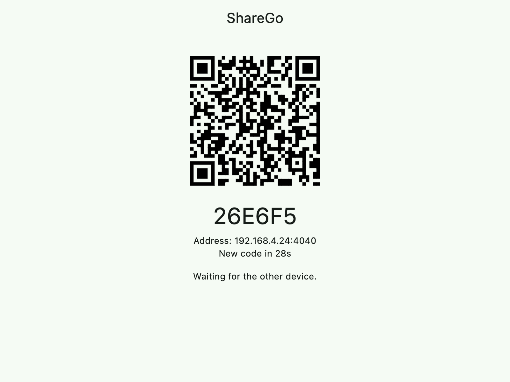
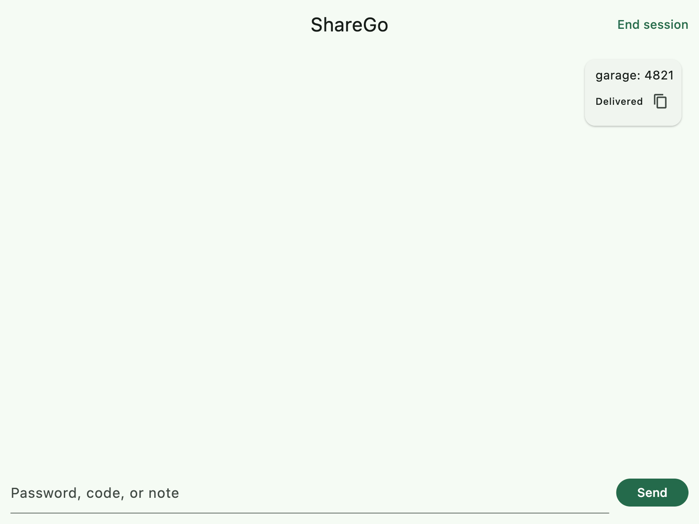
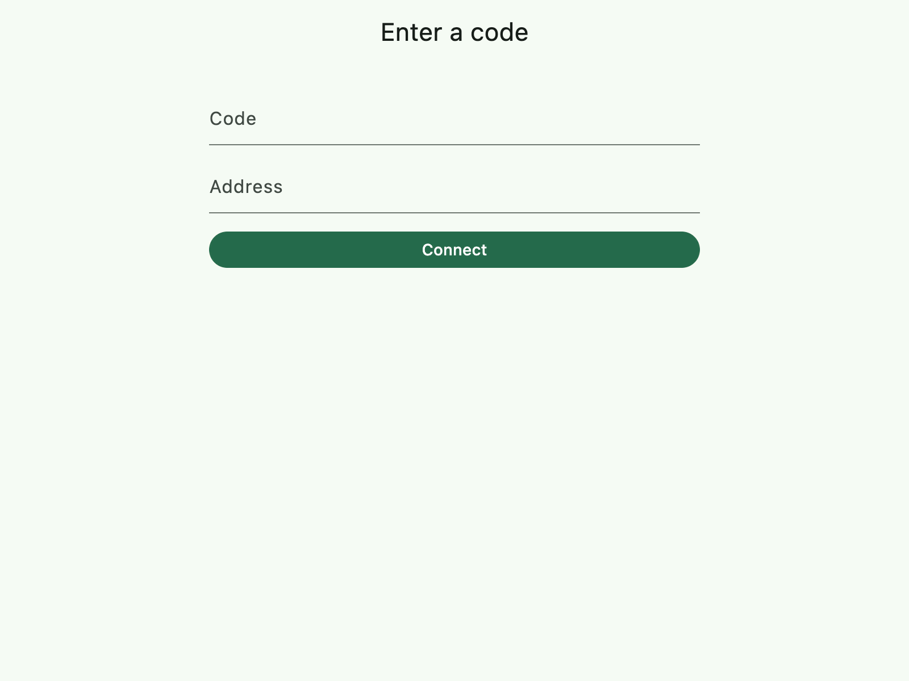

<p align="center">
  
</p>

<h1 align="center">ShareGo</h1>

<p align="center">
  Hand a password, a code, or a note to one other device on the same Wi-Fi.<br>
  Encrypted on the device. Nothing stored. Nothing sent to a server.
</p>

<p align="center">
  <a href="https://github.com/MehdiMamas/ShareGo/releases/tag/v2.0.0"><strong>Download v2.0.0</strong></a>
</p>

<p align="center">
  
  
  
</p>

## Download

| File | What to do |
| --- | --- |
| [ShareGo-windows.zip](https://github.com/MehdiMamas/ShareGo/releases/download/v2.0.0/ShareGo-windows.zip) | Unzip and run `ShareGo.exe`. Allow it on private networks when Windows asks. |
| [ShareGo-macos.dmg](https://github.com/MehdiMamas/ShareGo/releases/download/v2.0.0/ShareGo-macos.dmg) | Open the disk image and move ShareGo to Applications. |
| [ShareGo-android.apk](https://github.com/MehdiMamas/ShareGo/releases/download/v2.0.0/ShareGo-android.apk) | Install the APK. |
| [ShareGo-linux.tar.gz](https://github.com/MehdiMamas/ShareGo/releases/download/v2.0.0/ShareGo-linux.tar.gz) | Unpack and run `ShareGo`. |
| [ShareGo-unsigned.ipa](https://github.com/MehdiMamas/ShareGo/releases/download/v2.0.0/ShareGo-unsigned.ipa) | Sideload with AltStore or Sideloadly. |

The macOS app is not notarized yet, so Gatekeeper will warn the first time you open it.

## How a transfer works

1. On the device that will receive, tap **Show a code**. It shows a QR code, a 6-character code, and an address. They change every 30 seconds until someone connects.
2. On the other device, tap **Enter a code**. Scan the QR code, or type the code. If the code is not found on the network, type the address shown on the first device.
3. Both screens show the same number. Compare it, then tap **Approve** on the receiving device. A QR scan also checks the public key in the code.
4. Type the secret and send it. **End session** closes the connection and clears the messages.

Exactly two devices. A third device cannot join. Start a new code for a new pair.

<p align="center">
  
</p>

## What stays on the Wi-Fi

- The two devices talk over TCP on the local network. There is no cloud, relay, or signup.
- Each code uses a new X25519 key. The message key is derived with HKDF-SHA256 and the text is encrypted with XChaCha20-Poly1305.
- Keys and messages are wiped when the session ends. Nothing is written to disk.

## Develop

Flutter stable, plus the SDK for the platform you run. See [docs/BUILDING.md](docs/BUILDING.md).

```bash
flutter pub get
flutter test
flutter run
```

- [Protocol](docs/PROTOCOL.md)
- [Architecture](docs/ARCHITECTURE.md)
- [Threat model](docs/THREAT_MODEL.md)
- [Security policy](SECURITY.md)
