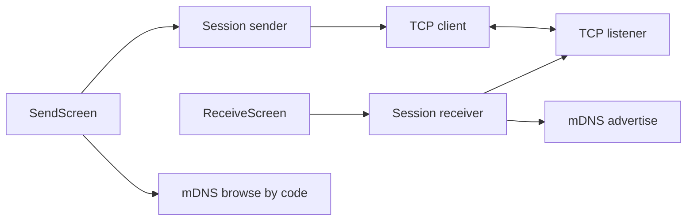

# Architecture

One Flutter app, in this repository, builds the Android, iOS, macOS, Windows, and Linux binaries. There is no embedded browser.

```
lib/
  main.dart              app shell
  config.dart            timeouts, port, size limits
  strings.dart           user-facing text
  core/crypto.dart       X25519, HKDF, XChaCha20-Poly1305
  core/frames.dart       length-prefixed TCP frames
  core/protocol.dart     message and QR parsing
  core/session.dart      receiver and sender state
  core/discovery.dart    mDNS advertise and browse
  ui/                    home, receive, send, chat, scanner
```

`Session` owns the socket and the keys. The screens own discovery and the widgets. Discovery is optional: if mDNS fails, the sender uses the address typed in by the person.



State is a `ChangeNotifier` with phases `idle`, `waiting`, `pending`, `active`, and `closed`. There is no second state store.

Crypto goes through the `cryptography` package. On Android, iOS, and macOS, `cryptography_flutter` uses the platform implementation when the operating system provides the algorithm, and the Dart implementation otherwise. Windows and Linux use the Dart implementation. The algorithms are the same on every platform.

mDNS uses Bonsoir (`_sharego._tcp`). QR display uses `qr_flutter`. The camera scanner uses `mobile_scanner` and is only opened on Android and iOS.
